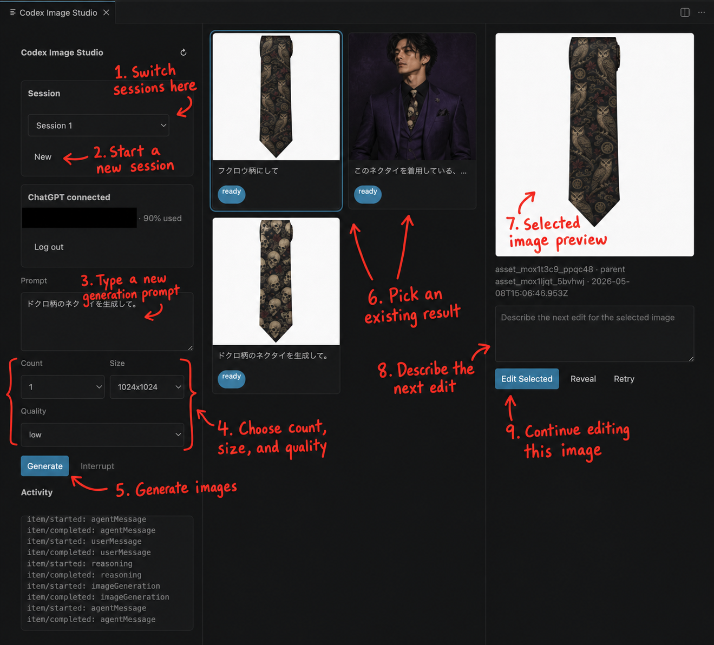

# Codex Image Studio

Codex Image Studio is a VS Code extension prototype for generating and iteratively editing images through `codex app-server`.

The extension uses ChatGPT managed auth through Codex. It does not ask for or store an OpenAI API key.

Generated assets and image history are stored in the current workspace under `.codex-image-studio/`. The manifest tracks image sessions, the active session, and every asset's `sessionId`, so the webview can switch between separate image histories while keeping the files on disk.

Codex auth, config, and session files are stored separately in VS Code extension global storage under `codex-home/`, and the extension launches `codex app-server` with `CODEX_HOME` pointed there. The extension does not copy `~/.codex/auth.json` into a workspace.

The extension does not allow workspaces to override the Codex executable path. Image paths loaded from `.codex-image-studio/manifest.json` are accepted only when they are relative `.png` files under `.codex-image-studio/images/`. Codex turns do not receive the credential-bearing `codex-home/` directory as a sandbox root; only the workspace and non-secret runtime subdirectories needed for sessions and generated images are writable.

## Commands

- `Codex Image Studio: Open`
- `Codex Image Studio: Log in with ChatGPT`
- `Codex Image Studio: Log out`
- `Codex Image Studio: Refresh`
- `Codex Image Studio: Interrupt Current Turn`
- `Codex Image Studio: New Session`

## Quick Start

```sh
npm install
npm run compile
```

Open this extension project in VS Code and press `F5` to launch an Extension Development Host. In the new VS Code window, open the Command Palette and run `Codex Image Studio: Open`.

If ChatGPT is not connected yet, run `Codex Image Studio: Log in with ChatGPT` or click `Log in` in the panel. The browser sign-in flow opens externally. After completing login, return to VS Code and run the image request again.

## Panel Guide



1. Switch sessions here: use the `Session` dropdown to move between separate image histories.
2. Start a new session: click `New` to create a fresh session for a new image direction.
3. Type a new generation prompt: enter the prompt for new image candidates in `Prompt`.
4. Choose count, size, and quality: adjust how many images to request and the desired output settings.
5. Generate images: click `Generate` to start a Codex image generation turn.
6. Pick an existing result: select any image card in the center gallery to make it the active image.
7. Selected image preview: the right pane shows the currently selected image at a larger size.
8. Describe the next edit: type an edit instruction for the selected image in the right-side text area.
9. Continue editing this image: click `Edit Selected` to create a new image based on the selected one.

## Storage

- `.codex-image-studio/manifest.json` stores `sessions`, `activeSessionId`, and `assets`.
- `.codex-image-studio/images/` stores generated PNG files.
- Creating a new session starts a separate Codex thread on the next generation.
- Switching back to a previous session restores its gallery and reuses its recorded Codex thread when possible.

## Codex CLI Resolution

For security, the extension does not read a workspace-controlled `codexCommand` setting and does not execute `codex` from the workspace or arbitrary `PATH` entries. It currently resolves Codex from trusted locations only:

- the bundled Codex binary in the ChatGPT VS Code extension
- `/opt/homebrew/bin/codex`
- `/usr/local/bin/codex`

If Codex was installed with npm, it works only when the resulting `codex` executable is symlinked into one of those trusted locations. Installs managed by `nvm`, `asdf`, `volta`, or a repo-local `node_modules/.bin/codex` may not be detected. A future version can add a user-level `application` or `machine` scoped setting for custom paths without allowing malicious workspaces to override the executable.

## Development

```sh
npm install
npm run compile
```

Run the extension from VS Code with `F5`, then open `Codex Image Studio: Open`.
